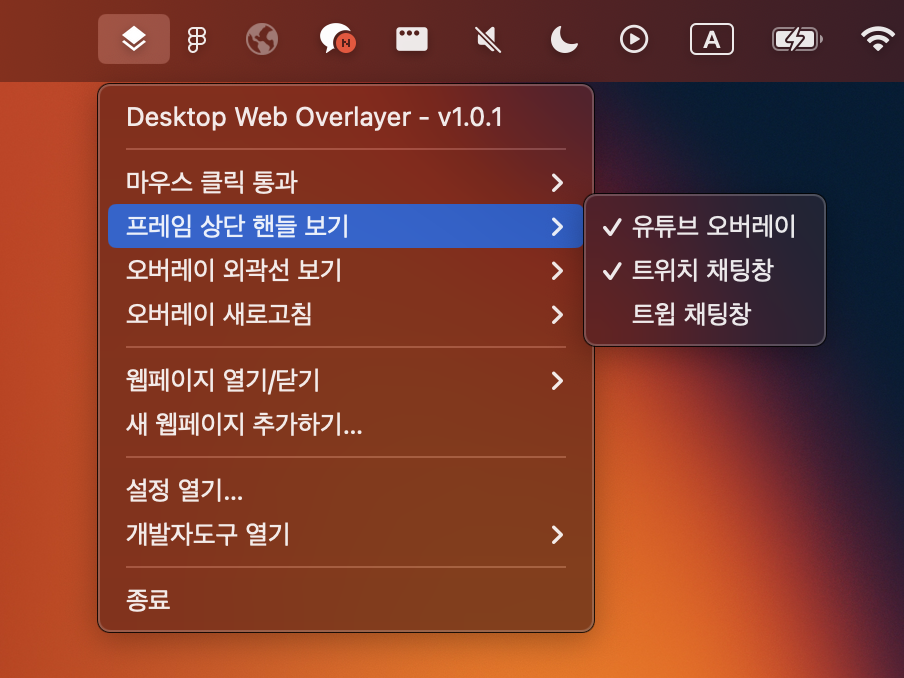
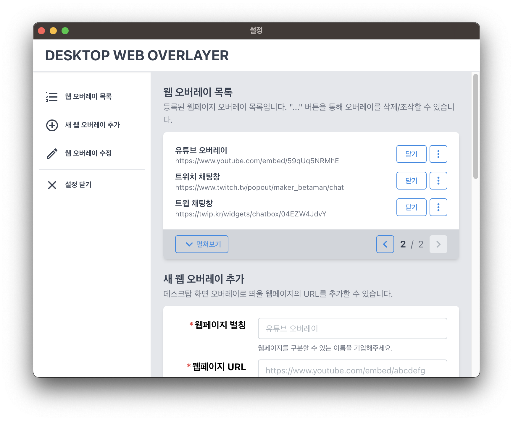
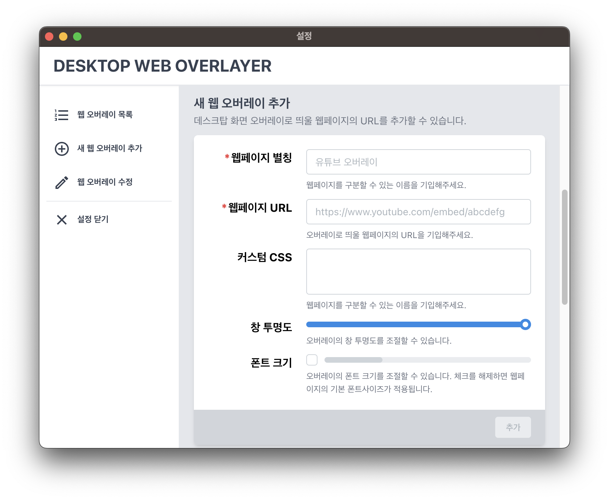
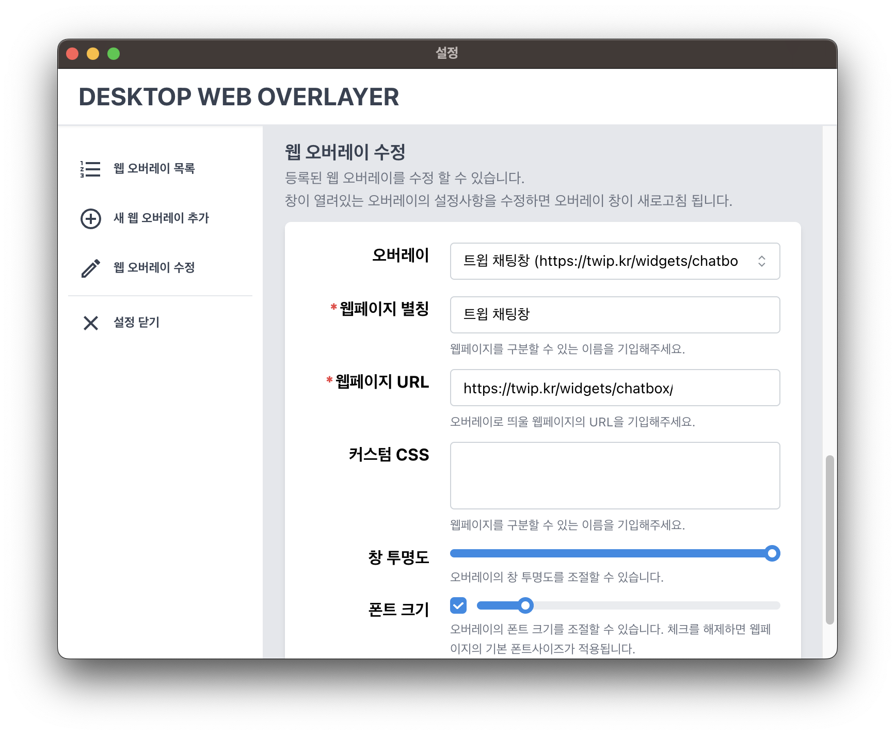

# DESKTOP WEB OVERLAYER

---

데스크탑 화면에 웹 페이지 오버레이들을 띄울 수 있는 Electron 유틸리티


## Commands

```sh
# 패키지 설치
pnpm install

# 개발 환경 실행
pnpm dev

# 빌드
pnpm build

# 프로덕션 환경 실행 (빌드를 우선 실행 해야함)
pnpm start

# 실행파일 빌드 (빌드를 우선 실행해야함)
pnpm deploy:mac # mac
pnpm deploy:win32 # windows 32bit
pnpm deploy:win64 # windows 64bit
pnpm deploy:all # 전체 아키텍쳐 모두 빌드

# electron app에만 pnpm 명령 실행
# ex) pnpm --filter @desktop-web-overlayer/electron add react-hook-form
pnpm --filter @desktop-web-overlayer/electron {commands}

# view app에만 pnpm 명령 실행
# ex) pnpm --filter @desktop-web-overlayer/view add react-hook-form
pnpm --filter @desktop-web-overlayer/view {commands}
```

## Features

- 데스크탑 화면에 여러 웹페이지를 오버레이 위젯으로 배치할 수 있는 기능
- 오버레이 위젯 세부 기능
  - 오버레이 창 위치/크기 저장 기능
  - 오버레이 창 외곽선 표시/숨김 기능
  - 오버레이 마우스 클릭 및 상호작용 비활성화 기능
  - 오버레이 투명 배경 기능
  - 오버레이 창 전체 투명도 조절 기능
  - 오버레이 웹페이지의 CSS 커스터마이징 기능
  - 오버레이 폰트 크기 조절 기능

<p align="center">
  
</p>





## Tech Stack

| 분류                       | 적용기술                                    |
| -------------------------- | ------------------------------------------- |
| **Package manager**        | pnpm                                        |
| **Parallel execution**     | Ultra runner                                |
| **Framework / UI Library** | Electron + React                            |
| **Bundler**                | Vite                                        |
| **Styling**                | Tailwind CSS + Mantine                      |
| **Validation**             | react-hook-form + zod + @hookform/resolvers |

## License

MIT License  
Copyright (c) 2023 Minsu Kang (BetaMan)
